<p align="center">


<h1><p align="center">AXM0F243 - Multisense platform</p></h1>

Strata Enablement
-----

This branch of the project enables this platform in Strata. See the Platform Documentation section below for the original documentation of the hardware and software. This section will lay out the modifications made to bring this platform into Strata.

#### Description of Application
This application can support up to 4 of the multi-sensor nodes described below. (Battery is CR2032) The receiver is connected to Strata and the sensor data from each of the remote nodes is displayed. The sensor data used in this revision is limited to the Temperature, Pressure, and Humidity from the BME680 sensor, and an optional Soil Moisture measurement from a Stemma I2C sensor.

The working UI is pictured below:

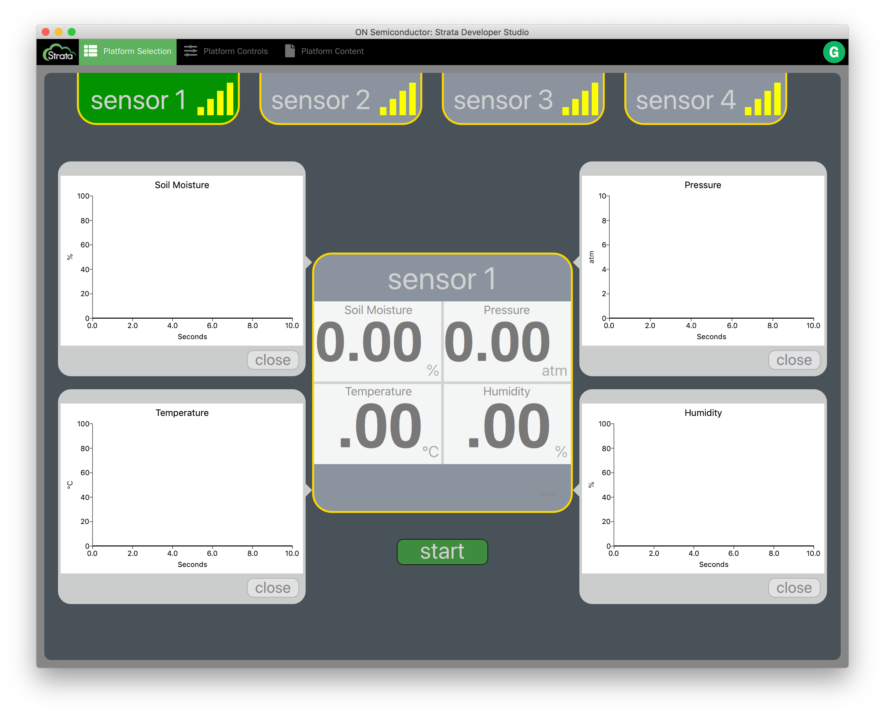

#### Set up of Demo (Unflashed DVK Boards)
1. Download and install the latest version of Strata that includes the Multi-sense UI. (Note, that the UI is being maintained by Brennan Dayberry and David Ralley at the Portland SEC. When BU enablement is complete, a link will be included here for the documentation of the UI development process)
2. Connect the Strata receiver (AXM0F243 DVK) and open the radiolab project
3. Press "Compile and Download Slave" to load the firmware onto the receiver board
4. For each of the battery-operated transmitter boards connect to the debugger (ribbon cable covers ON logo), Edit the sensor address from 1 to 4, as described below, and program the boards.
5. Open Strata and login
6. Re-connect the debug adapter to the receiver board. Strata should automatically load the UI screen
7. Insert batteries to the sensor nodes and flip switch to "battery". The board should power on and blink the LED every 5 seconds.
8. Press "start" in strata to begin visualizing the received data.

#### Strata Basics
Strata communicates with target PCBs using the serial COM port and JSON messages. The COM port uses the following settings:
1. 115,200 bps
2. 8 bits
3. 1 stop bit
4. no parity or flow control

Upon starting strata and reaching the platform selection page, Strata will  begin polling the available COM ports. For each port, Strata will send a Platform Identification Request, and a strata-enabled device will respond. After receiving a correct response, Strata will automatically load the appropriate platform screen. Various GUI elements in Strata will then trigger corresponding JSON commands from Strata.


 #### JSON Commands for AXM0F243 Sub-GHz Multi Sensor Platform

 ##### Platform Identification Request
//Strata -> Platform
```JSON
{
	"cmd": "request_platform_id",
	"payload": {}
}
```

//Platform -> Strata
```json
{
	"ack": "request_platform_id",
	"payload": {
		"return_value": true,
		"return_string": "Command Valid"
	}
}
```

//Platform -> Strata
```json
{
	"notification": {
		"value": " platform_id",
		"payload": {
			"name": "Sub-GHz Multi-sense Receiver",
			"platform_id": "232",
			"class_id": "223",
			"count": 1,
			"platform_version_id": "2.0"
		}
	}
}
```

##### Request Board information
//Strata -> Platform
```JSON
{
	"cmd": "request_platform_info",
	"payload": {}
}
```

//Platform -> Strata
```json
{
	"ack": "request_platform_info",
	"payload": {
		"return_value": true,
		"return_string": "Command Valid"
	}
}
```

//Platform -> Strata
```json
{
	"notification": {
		"value": "platform_info",
		"payload": {
			"firmware_ver": "0.0.0",
			"frequency": 868.3
		}
	}
}
```

##### Toggle Receive

//Strata -> Platform
```json
{
	"cmd": "toggle_receive",
	"payload": {
		"enabled": true
	}
}
```

//Platform -> Strata
```json
{
	"ack": "toggle_receive",
	"payload": {
		"return_value": true,
		"return_string": "Command Valid"
	}
}
```
//Platform -> Strata
```json
{
	"notification": {
		"value": "toggle_receive",
		"payload": {
			"enabled": true
		}
	}
}
```

##### Receive Data Notification

**_Note that this command only occurs when it is enabled with the Toggle Receive command_**

In this firmware, this command is called as part of the AX5043 Receiver callback, every time a message is received from one of the sensor nodes.

There can be different types of sensor nodes, and will be reported as either "multi" or "multi_soil" in the "sensor_type" field.

//Platform -> Strata
```json
{
	"notification": {
		"value": "receive_notification",
		"payload": {
			"sensor_id": "0x001",
			"sensor_type": "multi",
			"rssi": -67,
			"data": {
				"temperature": 24.044182,
				"pressure": 866.610840,
				"humidity": 46.606499,
				"soil": 0
			}
		}
	}
}

```
#### Firmware Implementation
##### Sensors
No changes were made to the Sensor Node documented below. To change the address of the Sensor node: modify the following on line 50 of main.c. For Strata, the final value of this array corresponds to sensor IDs 1 - 4.

```c++
uint8_t address[4] = {192,168,0,1};
```

##### Receiver
For the receiver, a very simple JSON parser was implemented. Because of the limited Flash and RAM available on the AXM0F243, a standard JSON parser library, such as those available on https://www.json.org/, was not able to be used.

The JSON command interface is implement in the files jci.c and jci.h. the command
```c++
process_uart()
```
is called from the main loop of the receiver, which is powered via USB and always running. (The MCU sleep is disabled) This function maintains a state machine which is non-blocking. As characters appear in the UART RX buffer, they are loaded into a temporary string. If a complete JSON frame is detected, the parsing is initiated. Due to the very limited set of commands available, a simple substring compare approach is used to determine which JSON command was received. The //Platform -> Strata JSON commands are almost all static, and are stored in strings and not modified. These strings can be found in jci.h.

The one return string that is modified is the receive_notification, which contains the received data. This necessitates the use of a printf type function. Because sprintf in the standard library is very heavy, a lightweight printf library is used and can be found in the files printf.c and printf.h.  The function
```c++
jci_send_receive_notification()
```
is used to extract the sensor data from the axradio_status struct and package it into the receive notification.

##### Network Protocol
The multiple access control for this demo is performed by enabling the LBT feature in AX-RadioLab. Each sensor node will check the channel and will wait 10 ms before attempting again if it detects another transmission. This protocol does not account for the "hidden node" problem, where 2 nodes are within range of the receiver, but out of range of each other. It is assumed that this demo will be used in trade shows and other venues where the sensor nodes are all relatively close. To adapt this project to a true long-range sensor network, a more advanced handshaking protocol may be required to coordinate network traffic.


Platform documentation
-----
1. ## Introduction

   The AXM0F243 - Multisense platform is a sensor node platform using the AXM0F243, a SoC  from ONSemiconductor combining the SubGHz transceiver AX5043 and a Cortex-M0+ MCU ([Link to product page](https://www.onsemi.com/PowerSolutions/product.do?id=AXM0F243)).

   It integrates two sensors from Bosh Sensortec :

   1. BME680, an ultra low power environment sensor including temperature, pressure, humidity and gas quality (Air Quality Index).([Link to product page](https://www.bosch-sensortec.com/bst/products/all_products/bme680))
   2. BMA400, an ultra low power and smart 3-axis accelerometer.([Link to product page](https://www.bosch-sensortec.com/bst/products/all_products/bma400_1)).

   It also integrate N24RF64, a 64 kb EEPROM with I2C and RFID (NFC compliant) interface from ONSemiconductor ([Link to Product page.](https://www.onsemi.com/PowerSolutions/product.do?id=N24RF64)).


   This repository contains the all files of the project including Radiolab project (Software to flash the platform), Eagle files for hardware part and documentation about software and characterization of the platform.

   The board is currently powered with a CR2032 battery and can reach 2 years lifetime with it. See section [4.Characterization](#Characterization) for more information.


2. ## Hardware development


   1. ### Schematic

      The hardware development using Eagle is based on DVK-AXM0F243-868-1-ANT-GEVB ([Link to product page](https://www.onsemi.com/PowerSolutions/evalBoard.do?id=DVK-AXM0F243-868-1-ANT-GEVB)).

      The board size is 40mm x 40mm, 2 layers.

      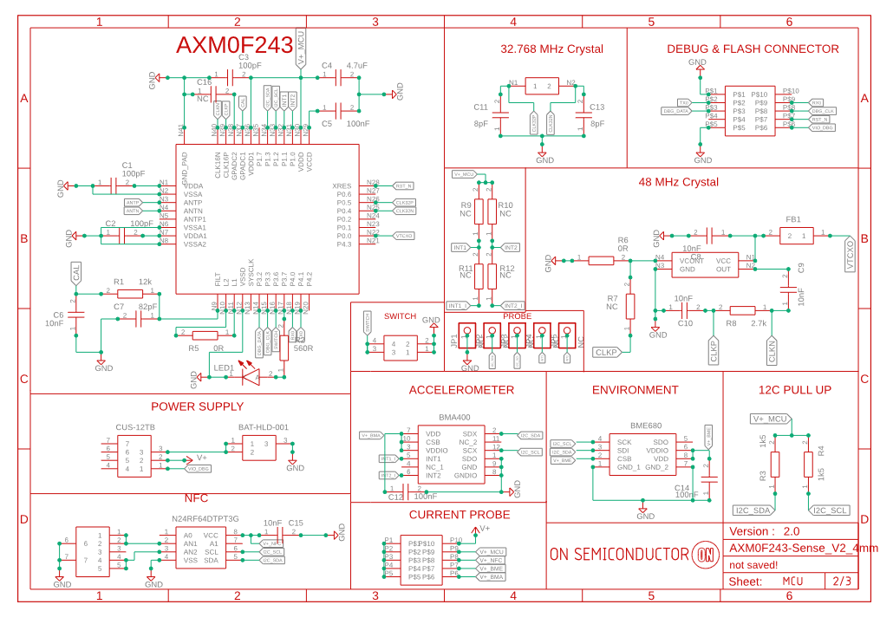


      There is a list of all features :

      1. 2*5 pin header for current probing. This way we can measure current of the entire board or only for a main component (MCU, BME680, BMA400 and N24RF64).
      2. BME680 environment sensor.
      3. BMA400 accelerometer sensor.
      4. N24RF64 EEPROM with RFID and I2C.
      5. Debug connector to flash and debug software.
      6. Switch to have the choice to power on from the battery or debug connector.
      7. 48 MHz TCXO.
      8. Header for probing BMA400 interrupt and I2C signals.
      9. LED for debug and transmit visual notification.
      10. Button connected to IO for application.

      Then we have the radio side of the board :

      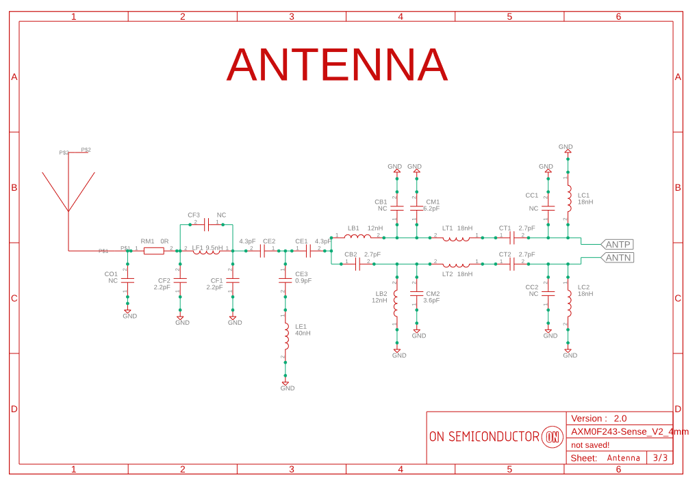


      This antenna is interfaced with dual PA of the SoC to enable RX and TX through radio. This is the schematic of the entire matching circuit. You can find this recommended matching circuit in the datasheet of the AXM0F243 ([AXM0F243 Datasheet's link](https://www.onsemi.com/pub/Collateral/AXM0F243-D.PDF)).

      The antenna is a 868MHz ceramic antenna from  YAEGO. You can find the Bill Of Materials inside the folder which include the all hardware eagle's project in this repository.

   2. ### Layout

      This is a 2 layers PCB. Components are ton TOP layer. However, in bottom layer you can find the battery holder and some pad for 0-Ohm resistance if you want to replace the TCXO with a Crystal or to link the interrupt of BMA400 with the AXM0F243 (a 0Ohm resistance need to be placed at least for BMA400 project provided in this repository, see picture below).

      Top view :

      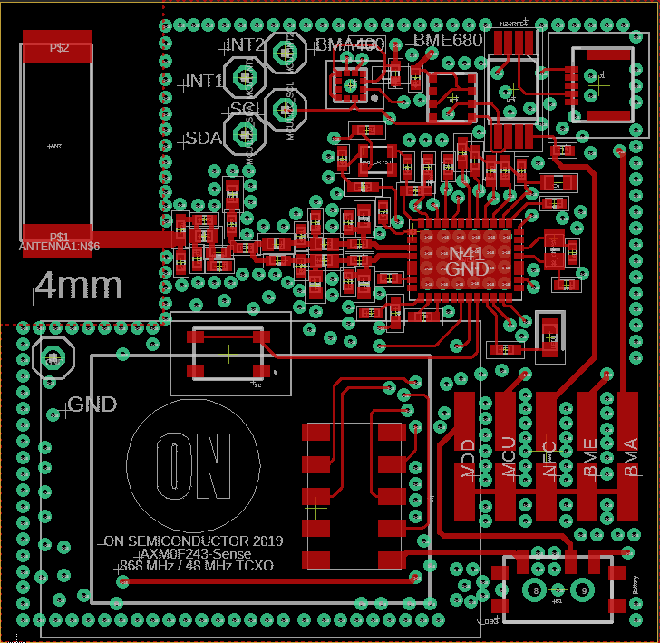

      Bottom view :

      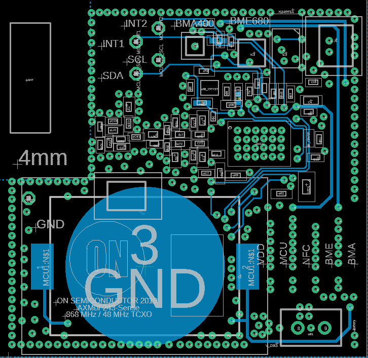

      And there is the result :

      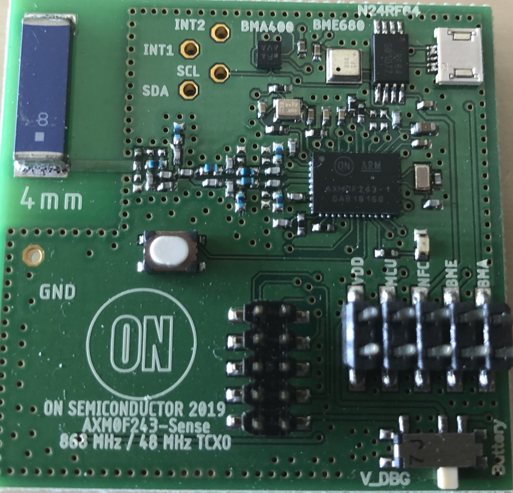


3. ## Software


   1. ### Setup

      To develop application for this platform, You need to download the software "Radiolab" That you can found in the product page of the AXM0F243 in section "Software" ([Link to product page](https://www.onsemi.com/PowerSolutions/product.do?id=AXM0F243)).

      Once the software is successfully installed, open the project you downloaded in this repository :

      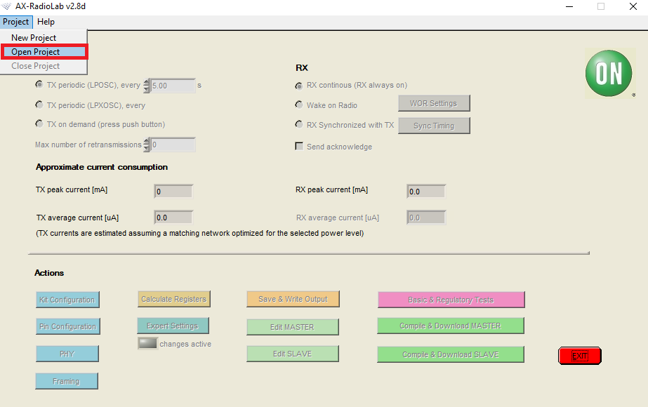

      Then click on Done when you are at the root of the project folder :

      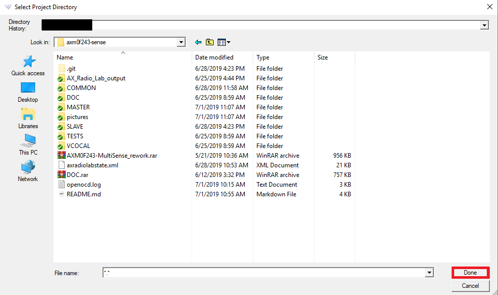

      Now we are ready to play with the AXM0F243-Multisense platform. This project contain libraries for BME680 and BMA400. The main has been modified to send data of BME680 with a timer interrupt and sending BMA400 by detecting movement with a threshold that you can modify. The timer interrupt for the BME680 can be directly setup in Radiolab.

      For the best power consumption performance, you should let TX mode to "TX periodic (LPOSC)". This mode will be the best for Deep Sleep consumption. Then you can modify the duty cycle for BME680 in the text prompt next to this TX mode :

      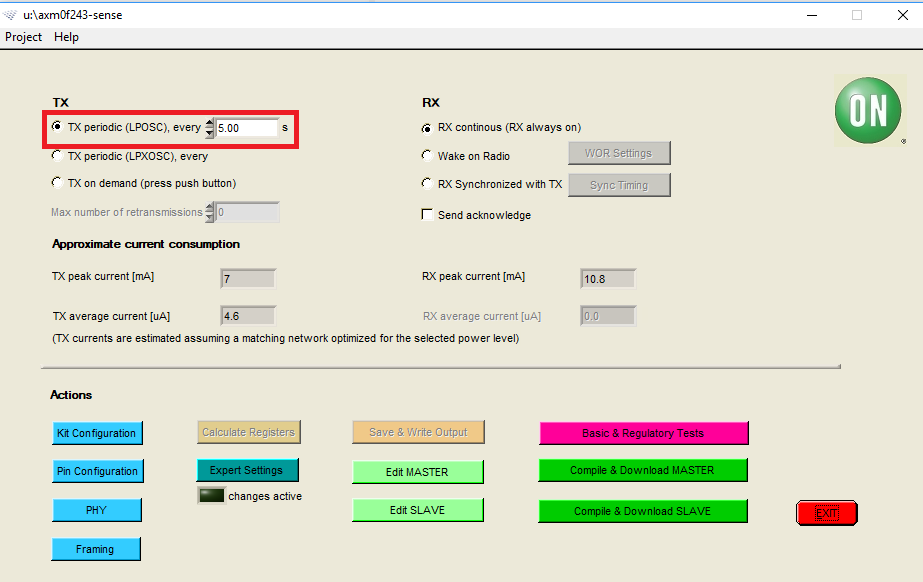

      There is two other settings that we need to take a look here : Data rate and TX output power. You can find it by clicking on "PHY" button :

      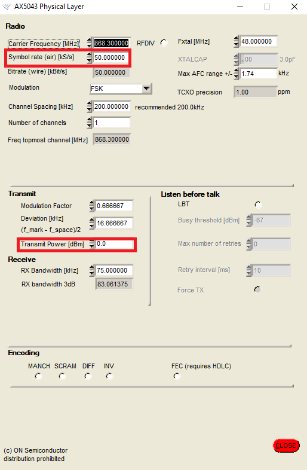

      For the rest of this documentation, we will be in FSK modulation so Symbol rate = Data rate.

      For information about others settings of Radiolab, please visit [this application note](https://www.onsemi.com/pub/Collateral/AND9356-D.PDF).


   2. ### AxCode::Blocks project

      This part will be an explanation of all code we added on the main. To modify the platform project, click on "EDIT MASTER" on Radiolab interface.


         3. #### Functions in main

            ```C
            #define BME680
            #define BMA400
            //#define UART0_DEBUG
            ```

            ​	After including libraries in the main file, you will find this three lines of code. First and second line are here to compile each part of the software related to a sensor. The last one are here only if you want to debug received data using UART (to check if data received from radio are the same for example).

            ```C
            void GPIOPort1_Handler()
            {
                NVIC_ClearPendingIRQ(GPIOPort1_IRQn);

                if(GPIO_PRT1->INTR & 0x02)
                {
                        intBMA = 1;
                }

                GPIO_PRT1->INTR |= 1<<1;
            }
            ```

            ​	This function will be executed when the interrupt from BMA400 is triggered. It will put intBMA = 1 and reset the interrupt status. This interrupt is on Port 1.1.

            ```C
            void transmit_packet(uint8_t *array, uint8_t len) // modified version to sent custom packet
            {
                uint8_t __xdata demo_packet_[len];

                ++pkt_counter;
                    memcpy(demo_packet_, array, len);
                if (framing_insert_counter)
                {
                    demo_packet_[framing_counter_pos] = pkt_counter & 0xFF ;
                    demo_packet_[framing_counter_pos+1] = (pkt_counter>>8) & 0xFF;
                }
                axradio_transmit(&remoteaddr, demo_packet_, len);
            }
            ```

            ​	Basically this function was only able to send the demo packet setup in Radiolab. we modified it so now it's possible to send custom packet by passing it into argument.

            ```C
            static void wakeup_callback(struct wtimer_desc __xdata *desc) // read and send BME680 data
            {
                desc;
                #ifdef BME680
                    wakeup_desc.time += wtimer0_correctinterval(WTIMER0_PERIOD);
                    wtimer0_addabsolute(&wakeup_desc);

                    gas_sensor.power_mode = BME680_FORCED_MODE;
                    rslt = bme680_set_sensor_mode(&gas_sensor);
                    delay_ms(profil_duration);
                    rslt = bme680_get_sensor_data(&data, &gas_sensor);
                    p = data.pressure / 100.0;
                    memcpy(&buffer_txBME[1],&data.temperature,sizeof(data.temperature)); // 32 bits float
                    memcpy(&buffer_txBME[5],&p,sizeof(data.pressure)); // 32 bits float
                    memcpy(&buffer_txBME[9],&data.humidity,sizeof(data.humidity)); // 32 bits float
                    transmit_packet(buffer_txBME, sizeof(buffer_txBME));

                #endif
                #ifdef BMA400

                #endif // BMA400
            }
            ```

            ​	This function is called on timer interrupt. It will read the BME680 data and send it through radio.
            To perform a reading of BME680, you have to put it on FORCED_MODE, so the sensor will perform a cycle of measurement. We need to have a delay between``` bme680_set_sensor_mode() ```  and ``` bme680_get_sensor_data() ``` so the BME680 can perform is measurement with no error. The duration we need to wait is defined in the setup of the sensor.

            ```C
            void setup_BME680(void)
            {
                gas_sensor.dev_id = BME680_I2C_ADDR_PRIMARY;
                gas_sensor.intf = BME680_I2C_INTF;
                gas_sensor.read = user_i2c_read;
                gas_sensor.write = user_i2c_write;
                gas_sensor.delay_ms = delay_ms;
                gas_sensor.amb_temp = 25;


                rslt = bme680_init(&gas_sensor);

                uint8_t set_required_settings;
                /* Set the temperature, pressure and humidity settings */
                gas_sensor.tph_sett.os_hum = BME680_OS_16X;
                gas_sensor.tph_sett.os_pres = BME680_OS_4X;
                gas_sensor.tph_sett.os_temp = BME680_OS_8X;
                gas_sensor.tph_sett.filter = BME680_FILTER_SIZE_3;
                /* Set the remaining gas sensor settings and link the heating profile */
                gas_sensor.gas_sett.run_gas = BME680_DISABLE_GAS_MEAS;
                /* Create a ramp heat waveform in 3 steps */
                gas_sensor.gas_sett.heatr_temp = 320; /* degree Celsius */
                gas_sensor.gas_sett.heatr_dur = 150; /* milliseconds */
                /* Select the power mode */
                /* Must be set before writing the sensor configuration */
                gas_sensor.power_mode = BME680_FORCED_MODE;
                /* Set the required sensor settings needed */
                set_required_settings = BME680_OSH_SEL;
                /* Set the desired sensor configuration */
                rslt = bme680_set_sensor_settings(set_required_settings,&gas_sensor);
                set_required_settings = BME680_FILTER_SEL;
                /* Set the desired sensor configuration */
                rslt = bme680_set_sensor_settings(set_required_settings,&gas_sensor);
                set_required_settings = BME680_GAS_SENSOR_SEL;
                /* Set the desired sensor configuration */
                rslt = bme680_set_sensor_settings(set_required_settings,&gas_sensor);
                /* Set the required sensor settings needed */
                set_required_settings =  BME680_OST_SEL | BME680_OSP_SEL;
                /* Set the desired sensor configuration */
                rslt = bme680_set_sensor_settings(set_required_settings,&gas_sensor);
                /* Set the power mode */
                rslt = bme680_set_sensor_mode(&gas_sensor);
                bme680_get_profile_dur(&profil_duration,&gas_sensor);
            }
            ```

            This function need to be called during the initialization of the platform (into the cold start to be called only once when the board is getting powered).

            1. We setup oversampling. Oversampling is the number of measure that will be proceed for each (Temp, pressure and humidity independently) to avoid small change during measurement. You can change it as you which by using a value that is defined (2,4,8,16). Default is 16.
            2. Gas measurement is disabled here and not proceed at all for now (Air Quality Index).
            3. You can notice that ```bme680_set_sensor_settings()``` is called four times. we noticed that if we called it only once by putting the all settings on ```set_required_settings``` variable, humidity which is the last to be configured is badly configured. So we decided to configure everything one thing at a time.
            4. Then we called ```bme680_get_profile_dur()```. This is the function that will give you the duration you need to wait before reading the value after putting BME680 into forced mode. This value depends the setting you are using so that's why we called it at the end.

         2. #### Main function	 	


               1. #### Cold start

                  ```C
                  #ifdef BME680
                      wakeup_desc.handler = wakeup_callback;
                  #endif // BME680
                  ```

                  ​	We added ifdef condition because if we only have BMA400 we don't want timer interrupt.

                  ```C
                  #ifdef BMA400
                     GPIO_PRT1->PC |= 1 << 3; // 1.1 INPUT
                     GPIO_PRT1->INTR_CFG |= 1<<2; // 1.1 to rising edge
                     NVIC_EnableIRQ(GPIOPort1_IRQn);
                     __enable_irq();
                  #endif // BMA400
                  ```

                  ​	This is enabling the interrupt for the BMA400. We are using rising edge interrupt.

                  ```C
                          #ifdef BME680
                          #if defined(WTIMER0_PERIOD)
                              wakeup_desc.time = wtimer0_correctinterval(WTIMER0_PERIOD);
                              wtimer0_addrelative(&wakeup_desc);
                          #endif
                          #endif // BME680
                  ```

                  ​	For the same reason, we only want timer interrupt with BME680 so we just added ifdef condition.

                  ```C
                          uart_timer1_baud(CLKSRC_FRCOSC, 115200, 48000000UL);
                          uart0_init(1, 8, 1);
                          delay_ms(5000); // just a wait to have time to connect HTERM on PC.
                          uart0_writestr("\rUART OK\r");
                          #endif // UART0_DEBUG
                  ```

                  ​	This is the initialization of the UART. This is compiled only when UART0_DEBUG is defined.

                  ```C
                  uint8_t i2c_status = i2c1_init(AXM0_I2C_MASTER,AXM0_I2C_FAST_MODE,AXM0_I2C_INT_DIV_0, AXM0_I2C_INTERNAL_CLK);
                  ```

                  ​	This is the initialization of the I2C driver of AXM0F243.

                  ```C
                          #ifdef BME680
                              buffer_txBME[0] = (uint8_t)'E';
                              setup_BME680();
                              #ifdef UART0_DEBUG
                                  uart0_writestr("BME680 OK\r");
                              #endif // UART0_DEBUG
                          #endif // BME680
                          #ifdef BMA400
                              if(BMA400_isReady())
                              {
                                  buffer_txBMA[0] = (uint8_t)'A';
                                  BMA400_init();
                                  #ifdef UART0_DEBUG
                                      uart0_writestr("BMA400 READY\r");
                                  #endif // UART0_DEBUG
                              }else
                              {
                                  #ifdef UART0_DEBUG
                                      uart0_writestr("BMA400 NOT CONNECTED");
                                  #endif // UART0_DEBUG
                              }
                              BMA400_setPowerMode(LOW_POWER);
                          #endif // BMA400
                  ```

                  ​	Once I2C is initialize, we can setup sensors. 'E' and 'A' is added to buffer so we can recognize which type of data we received through radio.


               2. #### Warm start

                  ​	At this moment, we almost removed the all code of the warm start. For your information, when your device is in deep sleep, it doesn't know where it stopped. So on wakeup it will execute the all main again but not the cold start, it will go to warm start instead. The only line of code we let on warm start now is :

                  ```C
                          setup_osc_calibration(AXM0XX_HFCLK_CLOCK_FREQ, CLKSRC_RSYSCLK); // NEED THIS !! IF COMMENTED, TIMER FOR DEEP SLEEP WILL HAVE A BIAS.
                  ```

                  ​	We did not notice any failure by removing the others lines so this way we are reducing the execution time.

               3. #### Infinite loop

                  ​	Because deep sleep is already managed by basic Radiolab project, BME680 is managed in timer interrupt, we just need to add an handler for the BMA400 :

                  ```C
                              #ifdef BMA400
                                  if(intBMA)
                                  {
                                      intBMA = 0;
                                      exit_critical(crit);
                                      BMA400_getAcc(&x,&y,&z);
                                      memcpy(&buffer_txBMA[1],&x,sizeof(x)); // 32 bits float
                                      memcpy(&buffer_txBMA[5],&y,sizeof(y)); // 32 bits float
                                      memcpy(&buffer_txBMA[9],&z,sizeof(z)); // 32 bits float
                                      transmit_packet(buffer_txBMA,sizeof(buffer_txBMA));
                                      BMA400_setPowerMode(LOW_POWER);
                                  }
                              #endif // BMA400
                  ```

                  ​	You remember intBMA that we modified into GPIO1_Handler function ? The numbers of instruction in a interrupt function is limited this is why we are processing like this.


                  ​	So there is the modification we made from the basic main of Radiolab to make our platform works. With this basis you should be able to do any application you want. You can also navigate into library of the sensors. BME680's library is the one provided from BOSH. BMA400's library is homemade


1. ## Characterization

   This section will provide information about lifetime and current consumption of the board depending multiple configuration. The battery used here is a CR2032. We will assume that we have a capacity of 210 mAh.

   An excel table has been made to report lifetime of AXM0F243-Multisense platform using only BME680 depending three different settings : Data rate, TX output power and Duty cycle. You can find in this repository a PowerPoint and an excel file about all this experiment. Here is a sample of this report :

   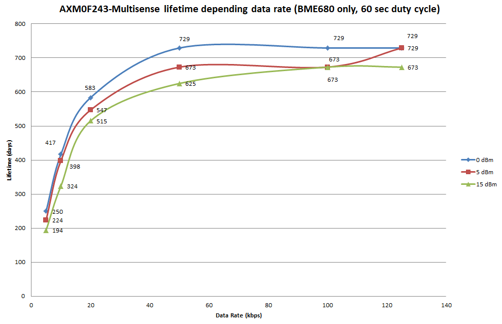

   We can notice that we have a lifetime over a year at any TX output power if data rate is >20 kbps.

   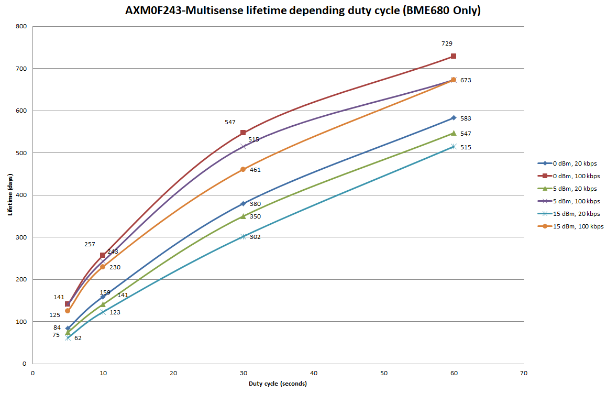

   The main observation here is that we have two group of curves determined by data rate. So we can notice that data rate is more important in the lifetime than TX output power. Indeed, we got a better lifetime with 100 kbps at 15 dBm instead of 20 kbps at any TX output power and any duty cycle.

   To check the 72 configurations that have been tested, you can open the excel (be sure to activate macros, check the powerpoint for more information).

   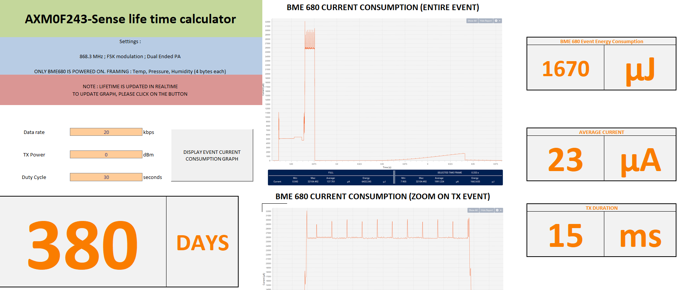
